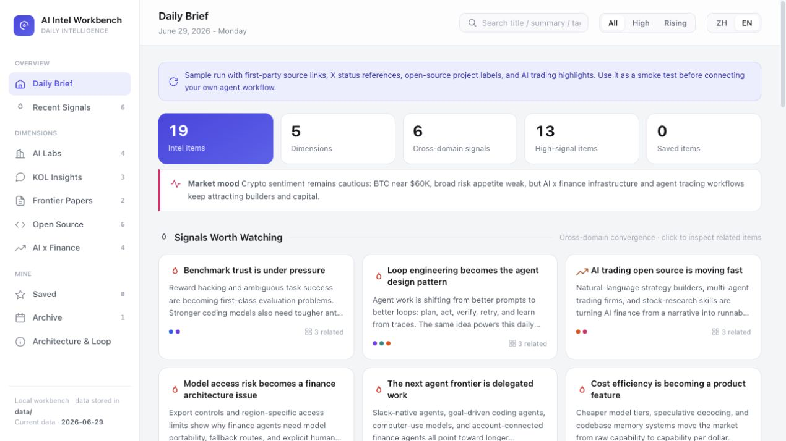

# Daily Intelligence Workbench

[English](README.md) | [中文](README.zh-CN.md)

Daily Intelligence Workbench is a **local-first, open-source deployable** workflow for daily AI industry intelligence. It combines configurable sources, industry anchors, agent-assisted research, structured digests, a local HTML dashboard, bot pushes, output-language selection, and local schedules.

Any agent runtime that can read a skill/instruction file, run local scripts, and trigger or install scheduled tasks can use this repository to initialize a workspace, produce daily intelligence, refresh the dashboard, and optionally push summaries to a bot.



Supported environments:

- Codex: install or open as a local plugin using `.codex-plugin/plugin.json` and `skills/`.
- Claude Code: run as a local repository workflow using `CLAUDE.md` and `skills/daily-intelligence-workbench/SKILL.md`.
- Plain local Python: Python 3 standard library is enough for the dashboard, validation, push, and scheduling scripts.

> The open-source default does not include any personal webhook, cookie, token, or account state. X/Twitter login state, API keys, and push bots are configured locally by each user.

---

## Repository Layout

```text
ai-intel-workbench/
├── .codex-plugin/plugin.json
├── AGENTS.md
├── CLAUDE.md
├── index.html
├── config/
│   ├── industry.yaml
│   ├── sources.yaml
│   ├── keywords.yaml
│   ├── kol.yaml
│   ├── push.yaml
│   ├── runtime.yaml
│   └── secrets.example.env
├── data/
│   ├── manifest.js
│   └── 2026/06/29/digest.js
├── docs/
│   └── 调研方法论与Loop设计.md
├── scripts/
│   ├── init.py
│   ├── run_daily.py
│   ├── validate_digest.py
│   ├── serve.py
│   ├── push_lark.py
│   └── install_schedule.py
└── skills/
    └── daily-intelligence-workbench/
```

---

## Quick Start

```bash
git clone https://github.com/weishao831/ai-intel-workbench.git
cd ai-intel-workbench

# Initialize anchors, output language, bot, port, and optional agent command.
python3 scripts/init.py

# Non-interactive example.
python3 scripts/init.py --anchors ai-crypto,ai-finance --language en --bot none

# Start the local dashboard.
python3 scripts/serve.py --port 4318
# Open http://127.0.0.1:4318/

# Validate bundled sample data.
python3 scripts/validate_digest.py --date latest

# Generate today's research task.
python3 scripts/run_daily.py --date today
```

If no agent command is configured, `run_daily.py` writes:

```text
.daily-intel/runs/YYYY-MM-DD/research_prompt.md
```

Give that prompt to Codex or Claude Code. The agent should research, produce canonical JSON, and write it back with `run_daily.py --from-json`.

---

## Output Language

Choose the user-facing digest language during initialization:

```bash
python3 scripts/init.py --language zh
python3 scripts/init.py --language en
python3 scripts/init.py --language bilingual
```

Or edit `config/runtime.yaml`:

```yaml
output_language: en        # zh | en | bilingual
```

Override per run:

```bash
python3 scripts/run_daily.py --date today --language en
```

Language modes:

- `zh`: Simplified Chinese output; technical terms, company names, project names, and URLs stay in their original form.
- `en`: English output; source names, project names, tickers, and URLs stay unchanged.
- `bilingual`: Chinese-first bilingual output, with concise English equivalents for titles and key summaries where useful.

---

## Codex Usage

The repository contains:

```text
.codex-plugin/plugin.json
skills/daily-intelligence-workbench/SKILL.md
```

Starter prompts:

- Initialize the daily intelligence workbench
- Generate today's AI intelligence digest
- Install the daily schedule
- Configure the X/Twitter provider

Codex should read `skills/daily-intelligence-workbench/SKILL.md` before running scripts.

---

## Claude Code Usage

Open Claude Code in the repository root:

```bash
cd ai-intel-workbench
claude
```

Ask Claude Code to read:

```text
CLAUDE.md
skills/daily-intelligence-workbench/SKILL.md
docs/调研方法论与Loop设计.md
```

Optional scheduled agent command in `config/runtime.yaml`:

```yaml
agent_command: claude -p "$(cat {prompt})"
```

Placeholders:

- `{date}`: date in `YYYY-MM-DD`
- `{root}`: workbench root directory
- `{prompt}`: generated research prompt path

---

## X/Twitter Provider Strategy

The open-source workflow does not depend on a user's Chrome login state by default.

Default provider:

- Public web search / source discovery
- Official blogs, arXiv, GitHub, Hugging Face, reputable media
- Public X status pages
- Public X profile pages

Optional providers:

- User-owned local Chrome or browser extension session
- X API or third-party data APIs
- User-supplied CSV/JSON/bookmark exports

Safety rules:

- Do not read, export, or commit cookies, localStorage, session tokens, passwords, or API keys.
- Do not follow, like, post, DM, solve CAPTCHAs, or bypass safety barriers.
- Do not promise "anti-ban" behavior. Use low-frequency, read-only, user-owned access with graceful fallback.

See `skills/daily-intelligence-workbench/references/source-providers.md`.

---

## Daily Run

Create only the research prompt:

```bash
python3 scripts/run_daily.py --date today
```

Write a digest from canonical JSON:

```bash
python3 scripts/run_daily.py --date 2026-06-30 --from-json /path/to/digest.json
python3 scripts/validate_digest.py --date 2026-06-30
```

Smoke test with bundled sample data:

```bash
python3 scripts/run_daily.py --date today --sample
```

Push after generation:

```bash
export DAILY_INTEL_LARK_WEBHOOK="https://open.larksuite.com/open-apis/bot/v2/hook/xxx"
python3 scripts/run_daily.py --date today --push
```

---

## Schedule

macOS uses LaunchAgent. Linux uses crontab.

```bash
python3 scripts/install_schedule.py install --time 08:30
python3 scripts/install_schedule.py install --time 08:30 --push
python3 scripts/install_schedule.py status
python3 scripts/install_schedule.py uninstall
```

The scheduled task runs:

```bash
python3 scripts/run_daily.py --date today
```

If `agent_command` is configured, the generated prompt is handed to that command.

---

## Push Bot

Edit `config/push.yaml`:

```yaml
enabled: true
bot_type: lark
webhook: https://open.larksuite.com/open-apis/bot/v2/hook/xxx
```

Before publishing, keep:

```yaml
enabled: false
webhook: ""
```

---

## Data Contract

Daily digest:

```text
data/YYYY/MM/DD/digest.js
```

Manifest:

```text
data/manifest.js
```

Canonical JSON schema:

```text
skills/daily-intelligence-workbench/references/data-schema.md
```

---

## Disclaimer

This project provides information aggregation and assisted analysis only. It is not investment advice. AI x finance and AI x trading content should be independently verified. Each item should preserve source URL, date, and confidence notes.
