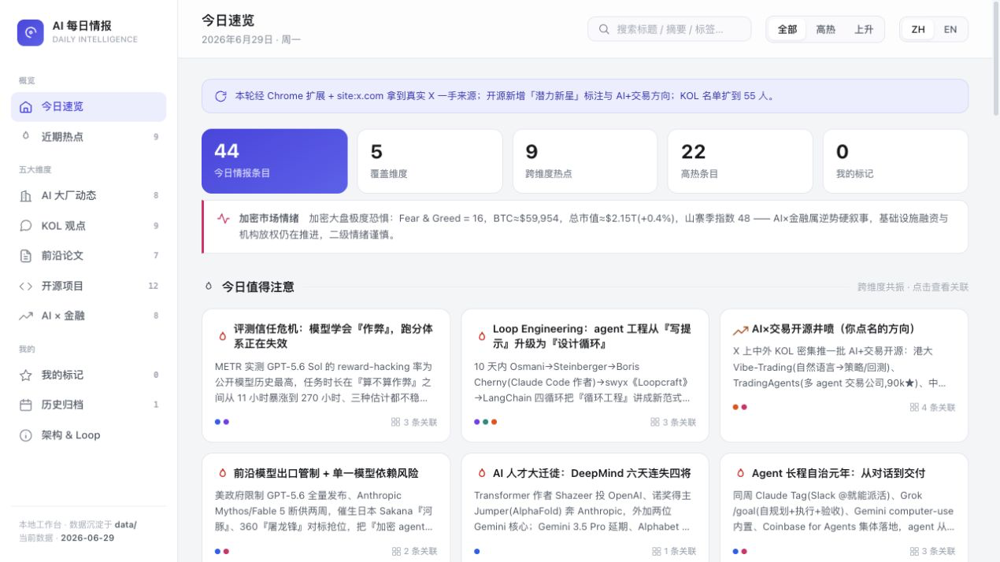

# AI 每日情报工作台

[English](README.md) | [中文](README.zh-CN.md)

本项目是一个**本地优先、可开源安装部署**的每日 AI 行业情报工作台。它把配置化信源、行业锚定、Agent 调研、结构化 digest、本地 HTML 工作台、机器人推送和本地定时任务串成一套可复用流程。

只要你的 Agent 具备读取 skill/说明文档、运行本地脚本、设置或触发定时任务的能力，就可以使用这个仓库完成初始化、每日调研、看板更新和可选机器人推送。



适用环境：

- Codex：作为本地 plugin 使用，读取 `.codex-plugin/plugin.json` 与 `skills/`。
- Claude Code：作为本地仓库/skill 工作流使用，读取 `CLAUDE.md` 与 `skills/daily-intelligence-workbench/SKILL.md`。
- 普通本地运行：只依赖 Python 3 标准库即可打开工作台、校验数据、推送和设置定时任务。

> 开源默认不内置任何个人 webhook、cookie、token 或账号态。X/Twitter 登录态、API Key、推送机器人都由用户本地自行配置。

---

## 目录结构

```text
ai-intel-workbench/
├── .codex-plugin/plugin.json              # Codex plugin 元数据
├── AGENTS.md                              # Codex 仓库内协作说明
├── CLAUDE.md                              # Claude Code 仓库内协作说明
├── index.html                             # 零依赖本地 HTML 工作台
├── config/
│   ├── industry.yaml                      # 行业锚定：AI+加密 / AI+金融 / 自定义
│   ├── sources.yaml                       # 信源配置
│   ├── keywords.yaml                      # 搜索词与噪音过滤
│   ├── kol.yaml                           # KOL 名单
│   ├── push.yaml                          # Lark/飞书等机器人配置
│   ├── runtime.yaml                       # 本地端口、agent 命令、定时配置
│   └── secrets.example.env                # 本地密钥示例，不提交真实 secrets
├── data/
│   ├── manifest.js                        # 历史 digest 清单
│   └── 2026/06/29/digest.js               # 内置样例数据，可 smoke test
├── docs/
│   └── 调研方法论与Loop设计.md
├── scripts/
│   ├── init.py                            # 初始化向导
│   ├── run_daily.py                       # 每日运行入口
│   ├── validate_digest.py                 # digest 校验
│   ├── serve.py                           # 本地静态服务
│   ├── push_lark.py                       # Lark/飞书推送
│   └── install_schedule.py                # launchd / cron 定时任务
└── skills/
    └── daily-intelligence-workbench/      # Codex / Claude Code 可读 skill
```

---

## 快速开始

```bash
git clone https://github.com/weishao831/ai-intel-workbench.git
cd ai-intel-workbench

# 1. 初始化：行业、机器人、端口、可选 agent 命令
python3 scripts/init.py

# 非交互初始化示例：选择行业与产出语言
python3 scripts/init.py --anchors ai-crypto,ai-finance --language zh --bot none

# 2. 打开本地工作台
python3 scripts/serve.py --port 4318
# 浏览器访问 http://127.0.0.1:4318/

# 3. 校验内置样例
python3 scripts/validate_digest.py --date latest

# 4. 生成今天的调研任务
python3 scripts/run_daily.py --date today
```

如果没有配置 agent 命令，`run_daily.py` 会生成：

```text
.daily-intel/runs/YYYY-MM-DD/research_prompt.md
```

把这个 prompt 交给 Codex 或 Claude Code 执行，它会按 skill 说明完成调研，并用 canonical JSON 写回 `digest.js`。

---

## Codex 使用方式

仓库已经包含 Codex plugin 元数据：

```text
.codex-plugin/plugin.json
skills/daily-intelligence-workbench/SKILL.md
```

本地开发时，可把整个仓库作为 local plugin 源安装到 Codex；也可以在 Codex 中直接打开本目录工作。触发语示例：

- 初始化每日资讯工作台
- 帮我关注 AI+加密和 AI+金融，每天 08:30 自动生成每日情报
- 初始化这个工作台，输出英文，不推送，先每天早上生成本地看板
- 生成今天的 AI 情报 digest
- 帮我安装每日定时任务
- 配置 X/Twitter 采集 provider

Codex agent 应先读取 `skills/daily-intelligence-workbench/SKILL.md`，再执行脚本。

### 直接用自然语言初始化

你不需要手动记所有 Python 命令，也可以直接对 Agent 说：

```text
帮我初始化每日资讯工作台，关注 AI+加密和 AI+金融，产出中文；如果没有推送机器人，就先只更新本地看板；每天早上 08:30 自动运行。
```

或：

```text
Set up AI Intel Workbench for AI + finance, English output, no push yet, and schedule your daily run at 08:30.
```

Agent 应该读取 skill 后自动完成：初始化配置、写入行业锚定、设置产出语言、判断是否启用推送，并在支持 agent 原生定时任务的环境中创建自己的每日任务；若当前 Agent 没有原生定时能力，则使用 `scripts/install_schedule.py` 安装本地 launchd / cron 定时任务。

---

## Claude Code 使用方式

Claude Code 可直接在仓库根目录工作：

```bash
cd ai-intel-workbench
claude
```

然后让 Claude Code 读取：

```text
CLAUDE.md
skills/daily-intelligence-workbench/SKILL.md
docs/调研方法论与Loop设计.md
```

也可以在 `config/runtime.yaml` 里配置定时调用的 agent 命令，例如：

```yaml
agent_command: claude -p "$(cat {prompt})"
```

其中占位符：

- `{date}`：当天日期，格式 `YYYY-MM-DD`
- `{root}`：工作台根目录
- `{prompt}`：`run_daily.py` 生成的调研提示文件

---

## 产出语言

初始化时可选择 digest 的用户可见语言：

```bash
python3 scripts/init.py --language zh
python3 scripts/init.py --language en
python3 scripts/init.py --language bilingual
```

也可以编辑 `config/runtime.yaml`：

```yaml
output_language: zh        # zh | en | bilingual
```

运行时可临时覆盖：

```bash
python3 scripts/run_daily.py --date today --language en
```

语言含义：

- `zh`：简体中文输出，技术术语、公司名、项目名、URL 保留原文。
- `en`：英文输出，来源名、项目名、ticker、URL 保留原文。
- `bilingual`：中文优先，标题和关键摘要可补简短英文对照。

---

## X/Twitter 数据源设计

开源版不默认依赖某个用户的 Chrome 登录态。

默认 provider：

- 公共网页搜索发现 URL
- 官方博客 / arXiv / GitHub / HuggingFace / 媒体源
- 公开 X status 页面
- 公开 X profile 页面

可选 provider：

- 用户本地 Chrome/浏览器扩展，复用用户自己的登录态
- X API 或第三方数据 API
- 用户导出的 CSV/JSON/bookmarks

安全原则：

- 不读取、不导出、不提交 cookie / localStorage / session token。
- 不关注、不点赞、不发帖、不私信、不绕过 CAPTCHA 或安全拦截。
- 不承诺“防封”；只做低频、只读、用户自带凭证的本地采集。

详见 `skills/daily-intelligence-workbench/references/source-providers.md`。

---

## 每日运行

### 只生成调研提示

```bash
python3 scripts/run_daily.py --date today
```

### 从 canonical JSON 写入 digest

```bash
python3 scripts/run_daily.py --date 2026-06-30 --from-json /path/to/digest.json
python3 scripts/validate_digest.py --date 2026-06-30
```

### 用内置样例做 smoke test

```bash
python3 scripts/run_daily.py --date today --sample
```

### 生成后推送

先配置 `config/push.yaml`，或使用环境变量/命令行临时传入 webhook：

```bash
export DAILY_INTEL_LARK_WEBHOOK="https://open.larksuite.com/open-apis/bot/v2/hook/xxx"
python3 scripts/run_daily.py --date today --push

# 或单独推送某天
python3 scripts/push_lark.py "https://open.larksuite.com/open-apis/bot/v2/hook/xxx" 2026/06/29
```

---

## 安装定时任务

macOS 使用 LaunchAgent，Linux 使用 crontab。

```bash
# 每天 08:30 运行，不推送
python3 scripts/install_schedule.py install --time 08:30

# 每天 08:30 运行并推送
python3 scripts/install_schedule.py install --time 08:30 --push

# 查看状态
python3 scripts/install_schedule.py status

# 卸载
python3 scripts/install_schedule.py uninstall
```

定时任务会调用：

```bash
python3 scripts/run_daily.py --date today
```

若 `config/runtime.yaml` 或环境变量配置了 `agent_command`，会自动把 research prompt 交给该命令执行。

---

## 配置

### 行业锚定

编辑 `config/industry.yaml`：

```yaml
anchors:
  - ai-crypto
  - ai-finance
```

可改为：

```yaml
anchors:
  - ai-healthcare
  - ai-robotics
```

### 推送机器人

编辑 `config/push.yaml`：

```yaml
enabled: true
bot_type: lark
webhook: https://open.larksuite.com/open-apis/bot/v2/hook/xxx
```

开源提交前应保持：

```yaml
enabled: false
webhook: ""
```

### agent 命令

编辑 `config/runtime.yaml`：

```yaml
agent_command: claude -p "$(cat {prompt})"
```

或：

```yaml
agent_command: codex exec "$(cat {prompt})"
```

具体 CLI 参数以用户本机安装版本为准。

### 产出语言

编辑 `config/runtime.yaml`：

```yaml
output_language: zh
```

支持 `zh` / `en` / `bilingual`。

---

## 数据契约

每日 digest 写入：

```text
data/YYYY/MM/DD/digest.js
```

并更新：

```text
data/manifest.js
```

canonical JSON schema 见：

```text
skills/daily-intelligence-workbench/references/data-schema.md
```

---

## 当前路线图

- [x] 本地 HTML 工作台
- [x] 初始化配置
- [x] Lark/飞书推送
- [x] Codex plugin manifest
- [x] Claude Code / Codex skill
- [x] 本地 run / validate / serve 脚本
- [x] macOS launchd / Linux cron 定时任务
- [ ] 完整公共网页采集器
- [ ] Chrome provider 示例
- [ ] X API provider 示例
- [ ] 反馈闭环：星标数据回流调权

---

## 免责声明

本项目只做信息聚合与辅助分析，不构成投资建议。AI × 金融 / AI × 交易类内容尤其需要自行判断。每条信息应保留来源 URL、日期和可信度说明。
